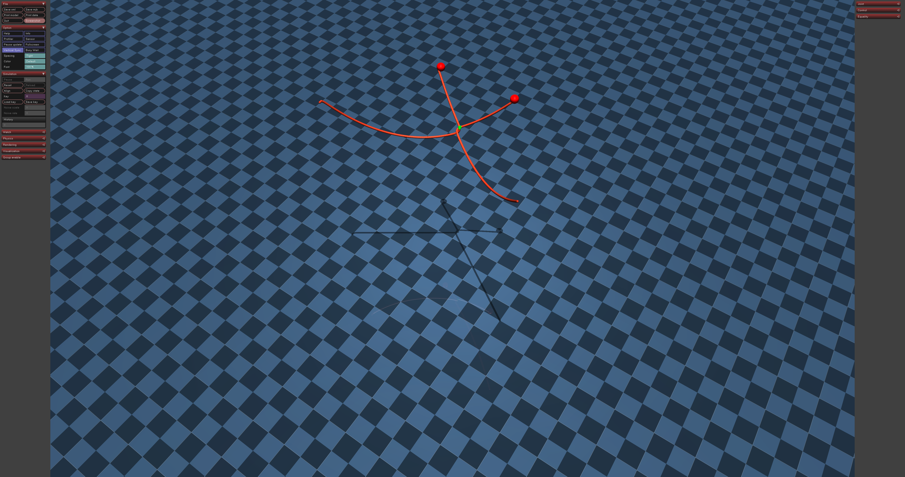

# Reinforcement Learning Policy for hitches. 

In this repository you will find the RL algorithms to learn hitch dynamics. This repo environmet was designed with the main objective be the most reliable as possible, Thus, it was designed and develop using docker dev containers. 


# Prerequisite 
- [Nvidia Container Toolkit](https://docs.nvidia.com/datacenter/cloud-native/container-toolkit/latest/install-guide.html)
- [Docker engine](https://docs.docker.com/engine/install/ubuntu/#install-using-the-repository)

This environment was tested in **Ubuntu 24.04**

## How to use it

1. Clone this repository in your local machine
2. Enable OpenGL in a container, run `xhost +local:root`
2. Open it with Visual Studio Code. **IMPORTANT**, you must have `dev container` and `docker extensions`. 
3. Inside VS code just run `ctrl + shift + p` and look for `Dev Containers: Reopen in Dev Container`
4. Once you are inside the container and dev environment, inside the folder [python_script](./python_script/) run:

```
python3 autonomous_hitch_move_online.py`
```

if everything runs well, you should see a mujoco window like this:


